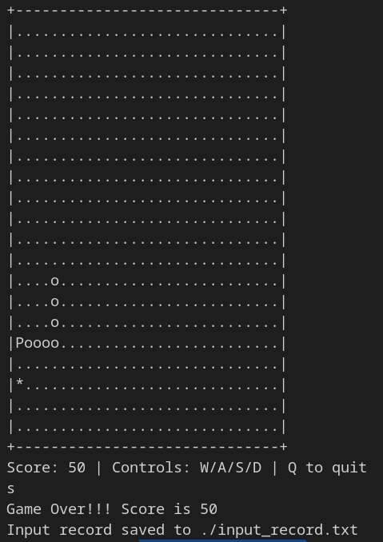

# Snake In The Grass



## Description
A terminal-based Snake game with threading and encryption capabilities. This project demonstrates parallel programming techniques using threads and synchronization (mutexes) using a classic snake game as a base. The game is designed to run in a terminal and includes input recording, secure data storage, and cross-platform compatibility(UNTESTED).

## Features

- **Classic Snake Gameplay**: Control a snake that grows as it eats food, trying to avoid collisions with walls and itself
- **Multithreaded Architecture**:
  - Separate rendering thread for smoother display updates
  - Thread synchronization using mutexes to prevent race conditions
  - Main thread handles game logic and input processing
- **Input Recording**: All player actions are recorded with timestamps
- **Secure Data Storage**: Game recordings are encrypted using:
  - Custom XOR encryption with time-based salt
  - Password protection for saved game data

## Controls
- **W**: Move Up
- **A**: Move Left
- **S**: Move Down
- **D**: Move Right
- **Q**: Quit Game

## Technical Implementation

### Threading & Parallelism
The game demonstrates concurrent programming through:
- Separation of rendering from game logic
- Mutex locks to protect shared game state
- Thread creation and cleanup

### Encryption System
Game recordings are protected using:
- XOR cipher with randomized salt values
- Time-based salt generation for enhanced security
- Automatic encryption of game records on exit

## Building and Running

### Prerequisites
- GCC compiler
- pthreads library
- For Unix/Linux: ncurses library

### Compilation and Running
```
make
```

```
./main
```
